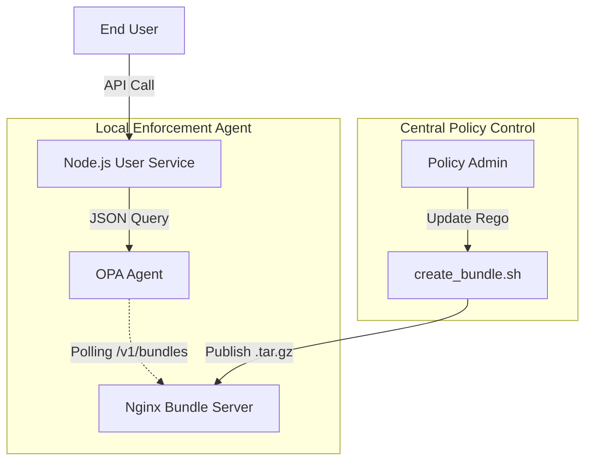

# 🌐 Complex OPA - Multi-Service RBAC

**Enterprise-grade OPA integration featuring policy bundles, distributed agents, and centralized Nginx management.**

## 🎯 What It Does
This project demonstrates the "Bundle & Agent" pattern used in large-scale microservice architectures. It decouples the policy lifecycle from service deployment by using a dedicated Bundle Server to distribute rules globally.

## ✨ Key Features
- **🔄 Dynamic Hot-Reload** - Update access rules instantly without redeploying code
- **📡 Distributed Sync** - Thousands of OPA agents can sync from a single Nginx source
- **🟢 Node.js Native** - Express.js integration using async authorization middleware
- **📦 Bundle Management** - Automated packaging of Rego files into production tarballs
- **📝 Audit Ready** - Centralized policy management for security compliance

## 🏗️ Architecture Design



### Authorization Flow
1. **Service Call**: User Service receives an Express request.
2. **Local Query**: Service queries the local OPA Agent (high availability).
3. **Auto-Polling**: The Agent pulls updated `rbac.tar.gz` bundles from Nginx every 10 seconds.
4. **Zero-Downtime**: Policies are hot-reloaded in-memory; no restart required.

## 🗺️ Architectural Blowout

> [!NOTE]
> For an enterprise-grade visualization of policy bundle distribution and distributed agent polling, visit the **Complex OPA** section in the root [Interactive Guide](index.html).

## 🏁 Quick Start

### Step 1: Initialize Policy Bundle
Policies must be packaged into a tarball before starting:
```bash
chmod +x create_bundle.sh
./create_bundle.sh
```

### Step 2: Start the Architecture
```bash
docker-compose up -d
```

### Step 3: Test Enforcement
- **Authorized Call**:
  ```bash
  curl -H "X-User-Role: user" http://localhost:3000/users
  ```
- **Unauthorized Call**:
  ```bash
  curl -H "X-User-Role: guest" http://localhost:3000/users
  ```

## 🛠️ Tech Stack & Patterns
- **Backend:** Node.js (Express)
- **Policy Server:** Nginx (Alpine)
- **Engine:** OPA Agent (Bundle mode)
- **Pattern:** Centralized Bundle Distribution

## ✅ Verification
Ensure policy integrity and service health:
- **Policy Tests:** `opa test policies/`
- **Polling logs:** Check `docker-compose logs opa` to verify bundle downloads.

---
**Version:** 1.0.0  
**Pattern:** Bundle Distribution 
