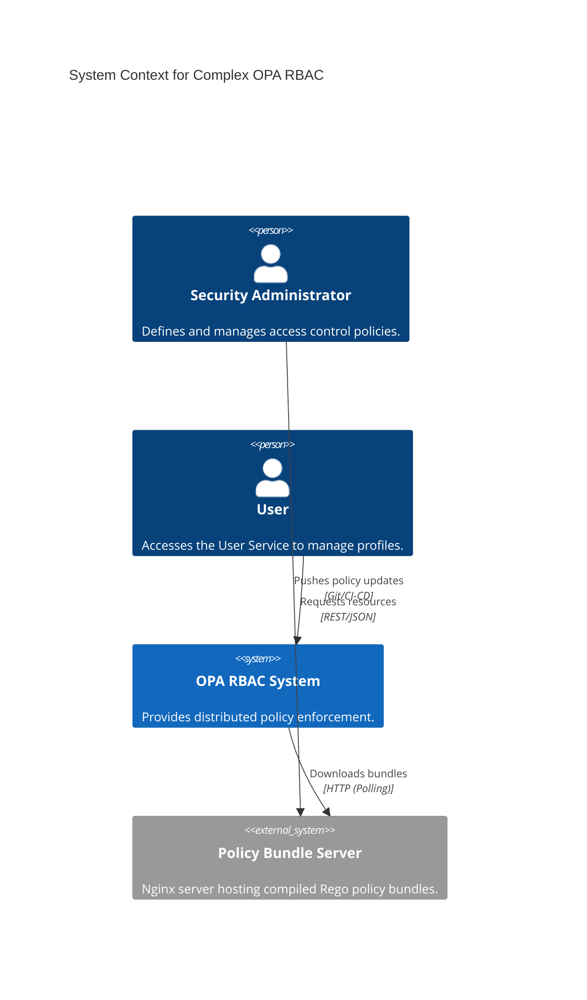
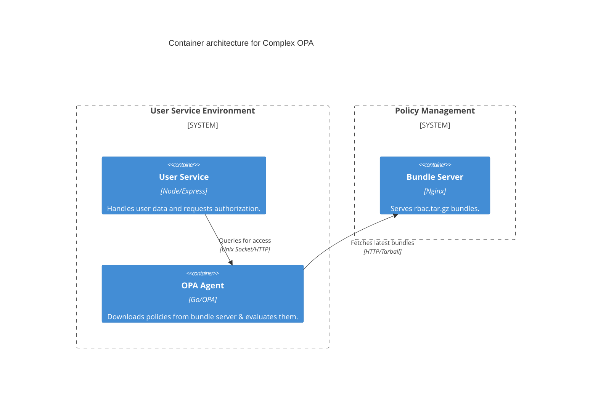

# Complex OPA - System Design

This project demonstrates a multi-service architecture with centralized policy management via a bundle server.

## C4 System Context Diagram

## C4 Container Diagram

## Implementation Strategy
- **OPA Agent**: Configured to poll the bundle server every 60 seconds.
- **Service Security**: The User Service only communicates with the local OPA agent.
- **Policy Distribution**: Policies are versioned and served as compressed tarballs.
