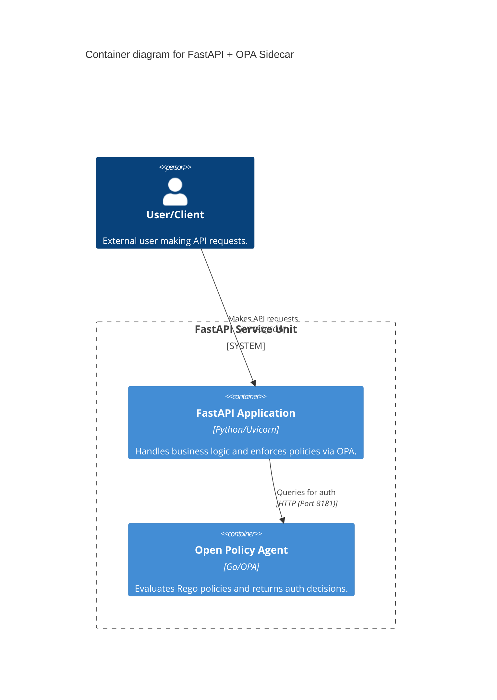

# ⚡ FastAPI Starter - OPA RBAC

**High-performance asynchronous API integration with Open Policy Agent (OPA) using the sidecar pattern.**

## 🎯 What It Does
This project demonstrates a production-grade FastAPI application that offloads authorization decisions to a dedicated OPA sidecar. It features async middleware enforcement and dynamic, Rego-based RBAC.

## ✨ Key Features
- **🚀 Async Enforcement** - Non-blocking OPA queries using `httpx` for maximum throughput
- **🛡️ Sidecar Isolation** - Decoupled security logic ensures your application code remains clean
- **📜 Dynamic Policy** - Centralized RBAC logic in Rego allows for updates without code changes
- **📊 Auto-Docs** - Built-in Swagger UI with policy-aware testing capability
- **🐳 Docker Native** - Ready-to-run environment with OPA and FastAPI perfectly synchronized

## 🏗️ Architecture Design



### Authorization Flow
1. **Interceptor**: FastAPI middleware catches the incoming request.
2. **Context extraction**: User identity and roles are extracted from protected headers.
3. **OPA Query**: API sends standardized input JSON to OPA's decision endpoint.
4. **Enforcement**: API allows or denies the request based on OPA's boolean result.

## 🗺️ Architectural Blowout

> [!NOTE]
> For a high-fidelity visual breakdown of the sidecar data flow and interactive code samples, refer to the **FastAPI Deep Dive** section in the root [Interactive Guide](index.html).

## 🏁 Quick Start

### Prerequisites
- Docker & Docker Compose installed

### Step 1: Start Services
```bash
docker-compose up -d
```

### Step 2: Verify Enforcement
- **Admin Access** (Allowed):
  ```bash
  curl -H "X-User-Role: admin" http://localhost:8000/admin
  ```
- **Unauthorized Access** (Forbidden):
  ```bash
  curl -H "X-User-Role: user" http://localhost:8000/admin
  ```

## 🛠️ Tech Stack & Patterns
- **Framework:** FastAPI (Python 3.11)
- **Engine:** Open Policy Agent (OPA)
- **Pattern:** Sidecar Enforcement Pattern
- **Networking:** Shared Docker Bridge network

## ✅ Verification
Ensure all systems are functioning correctly:
```bash
# Run the dedicated pytest suite
pytest api/tests/
```

### 🧪 Manual OPA Testing (Web UI)
1. Open **[http://localhost:8181](http://localhost:8181)** in your browser.
2. In the **Query** box, type: `data.rbac.allow`
3. In the **Input Data (JSON)** box, paste the `input` block from [test_scenarios.json](opa/test_scenarios.json).
   *Example:* `{"user": "alice", "role": "admin", "method": "GET", "path": ["admin"]}`
4. Click **Submit** to see the boolean result.

---

---
**Version:** 1.0.0  
**Pattern:** Sidecar 
