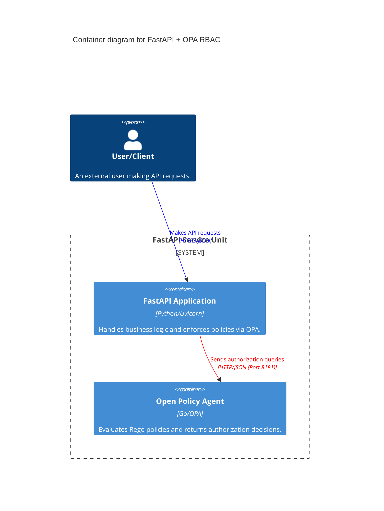
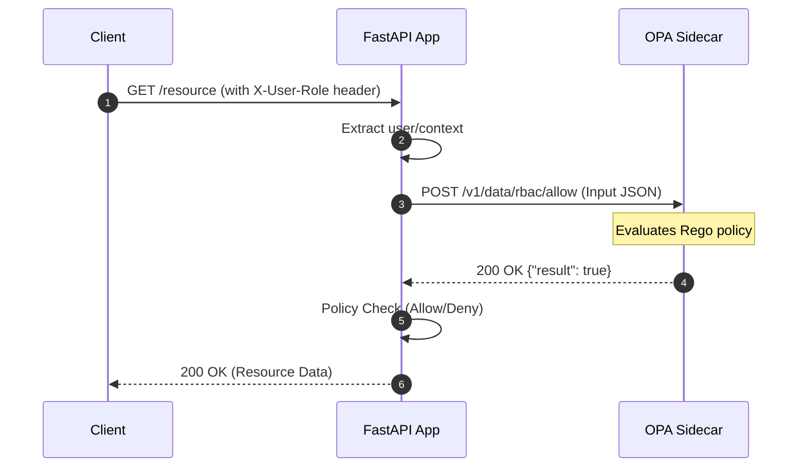

# FastAPI Starter - Architecture Diagrams

This document outlines the architectural design for the `fastapi-starter` project, which uses FastAPI with an OPA sidecar for RBAC.

## C4 Container Diagram

The system consists of two primary containers running in a single POD/Service unit (Docker Compose).



## Sequence Diagram: Authorization Flow

This diagram shows the step-by-step process of a request being authorized by OPA.



## Policy Input Schema

The data structure sent from FastAPI to OPA for decision making.

```json
{
  "input": {
    "method": "GET",
    "path": ["resource"],
    "user": "alice",
    "role": "admin"
  }
}
```
