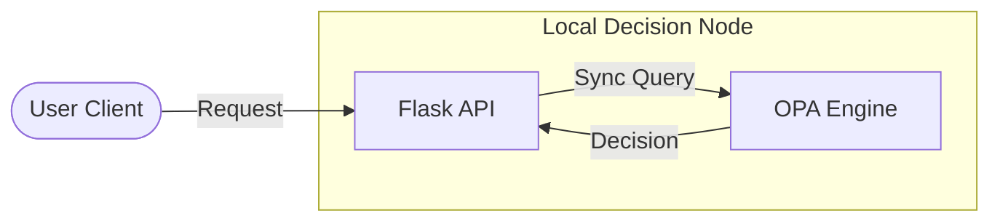

# 🍃 Simple OPA - Flask RBAC

**A lightweight, co-located OPA demonstration using a Python Flask API.**

## 🎯 What It Does
`simple-opa` provides a minimal blueprint for co-locating OPA with a backend service. This pattern is designed for lower complexity and zero-network-hop decision making when deployed in shared resource environments.

## ✨ Key Features
- **⚡ Low Latency** - Decisions are made locally over shared memory or localhost
- **🔌 Flask Integration** - Simple hook-based enforcement using `before_request`
- **🛠️ Prototyping Ready** - Ideal starting point for developers new to Rego and OPA
- **📁 Co-located Lifecycle** - Manage API and OPA lifecycle as a single logical unit

## 🏗️ Architecture Design



### Authorization Flow
1. **Hook**: Flask utilizes a global `before_request` interceptor.
2. **Identity**: Role information is extracted from request headers.
3. **Local Call**: The API calls OPA's REST API on the colocation host.
4. **Result**: Access is granted or denied immediately before the route logic runs.

## 🗺️ Architectural Blowout

> [!NOTE]
> For a detailed look at the Flask request lifecycle and co-located OPA decision points, explore the **Simple OPA** view in the root [Interactive Guide](index.html).

## 🏁 Quick Start

### Prerequisites
- Docker & Docker Compose installed

### Step 1: Start Environment
```bash
docker-compose up -d
```

### Step 2: Test Public Access
```bash
curl http://localhost:5001/public
```

### Step 3: Test RBAC Rules
- **User Access to Secure**:
  ```bash
  curl -H "X-User-Role: user" http://localhost:5001/secure
  ```
- **Unauthorized Access**:
  ```bash
  curl http://localhost:5001/secure
  ```

## 🛠️ Tech Stack & Patterns
- **Framework:** Flask (Python 3.11)
- **Engine:** Open Policy Agent (OPA)
- **Pattern:** Co-located Enforcement Pattern
- **Request Handling:** Synchronous `requests` library

## ✅ Verification
Verify the implementation logic:
```bash
# Run the local unit tests
pytest tests/
```

---
**Version:** 1.0.0  
**Pattern:** Co-located 
