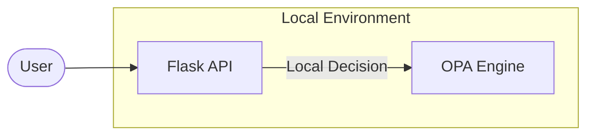

# Simple OPA - Architecture Overview

The `simple-opa` project demonstrates a co-located OPA setup where the OPA engine and the application interact directly within a shared environment.

## Design Goal
Minimize latency and complexity by hosting the OPA binary/container alongside the API.

## System Architecture

## Decision Flow
1. **Request**: User sends a request to the Flask API.
2. **Context**: Flask API collects request attributes (path, method, role).
3. **Query**: Flask API calls OPA's local endpoint.
4. **Enforce**: Flask API grants or denies access based on OPA's response.
